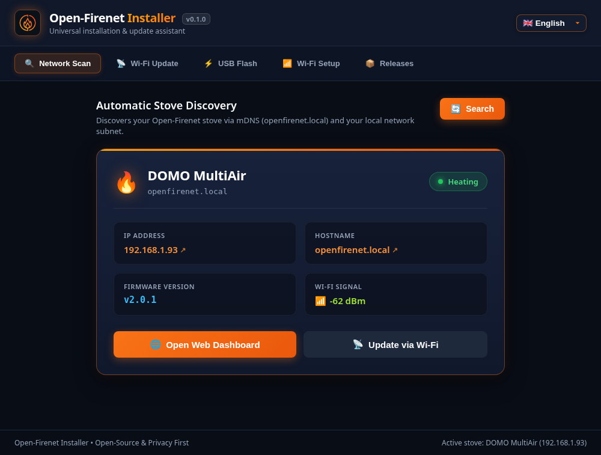
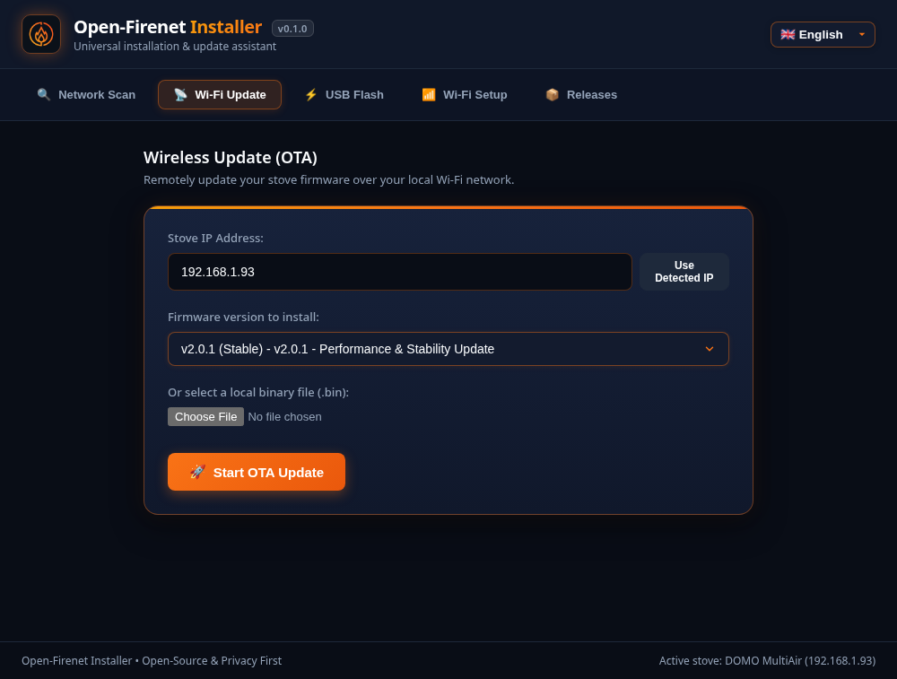
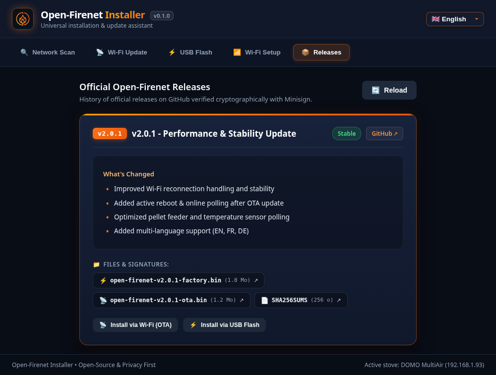

# 🔥 Open-Firenet Installer

[](LICENSE)
[](#downloads--releases)
[](https://www.rust-lang.org/)
[](https://tauri.app/)

> **[🇫🇷 Lire la documentation en français](README.fr.md)**

**Open-Firenet Installer** is the universal, cross-platform desktop GUI & CLI assistant to discover, flash, configure, and wirelessly update your **Open-Firenet** dongle (the open-source ESP32-S3 replacement for the proprietary RIKA Firenet module).

Unlike WebSerial solutions (ESP Web Tools) that **fail completely on Mozilla Firefox and Apple Safari**, Open-Firenet Installer runs natively across **Windows**, **macOS** (Apple Silicon & Intel), and **Linux** as a single, self-contained executable with zero external runtime dependencies (no Python or esptool installation needed).

---

## 📸 Screenshots

### 1. Automatic Stove Discovery & Status Dashboard
Instant discovery of your stove on the local network via mDNS (`openfirenet.local`) and subnet probing, displaying live operation state, firmware version, and Wi-Fi signal quality.



---

### 2. Over-the-Air Wireless Update (OTA)
Remotely upgrade your dongle straight from your sofa without ever having to unplug it from your stove. Includes real-time progress reporting, automatic reboot detection, and online confirmation.



---

### 3. USB Serial Flasher (Update & Factory Reset Modes)
Auto-detects plugged ESP32-S3 devices. Supports two flashing modes: **Update mode** (preserves Wi-Fi credentials and NVS settings) or **Full Factory Reset** (wipes and initializes flash memory).


---

### 4. Guided Wi-Fi Configuration
Easily provision your home Wi-Fi SSID and password directly over USB serial without manual AT commands.


---

### 5. Official GitHub Releases & Cryptographic Verification
Browse official stable releases and pre-releases, download binaries automatically, and verify authenticity via **Minisign** cryptographic signatures and SHA-256 checksums.



---

## ✨ Key Features

- **🔍 Automatic Network Discovery**: Detects your stove in seconds via mDNS and active subnet probing. Retrieves live stove model (*DOMO*, *INDUO*, etc.), operating status, IP address, and signal strength.
- **📡 Pure Rust ArduinoOTA Wireless Flasher**: Built-in, high-speed pure Rust OTA client eliminating Python or external script requirements. Automatically polls for the device to restart and come back online.
- **⚡ USB Serial Flasher with Safe Dual Modes**:
  - **Update Mode** (offset `0x10000`): Updates application firmware while preserving your stored Wi-Fi credentials and configuration.
  - **Full Reset / Factory Mode** (offset `0x0000`): Flashes a complete factory image onto new ESP32-S3 chips or for clean reinstalls.
- **🔒 Cryptographic Integrity & Security**: Official firmware binaries are verified using **Minisign** digital signatures against the official Open-Firenet community public key before flashing.
- **📶 Guided USB Wi-Fi Setup**: Provision Wi-Fi credentials over serial with a single click or terminal command.
- **📟 Embedded Serial Monitor**: Monitor live stove UART dialogue frames and boot logs directly inside your terminal.
- **🌐 Multilingual**: Built-in support for **English**, **French**, and **German**.
- **🖥️ Dual Mode (GUI & CLI)**: Automatically launches a sleek, modern Tauri graphical interface in desktop environments, or falls back to an interactive menu / command-line tool in headless/SSH setups.

---

## 📥 Downloads & Releases

Pre-compiled standalone binaries are available on the [**GitHub Releases**](https://github.com/openfirenet/open-firenet-installer/releases) page:

| Operating System & Architecture | Binary Name | Packaging |
|---|---|---|
| **Linux (x86_64)** | `open-firenet-installer-linux-x86_64` | Standalone ELF 64-bit |
| **Windows (x86_64)** | `open-firenet-installer-windows-x86_64.exe` | Standalone `.exe` executable |
| **macOS Apple Silicon (M1/M2/M3/M4)** | `open-firenet-installer-macos-arm64` | Standalone Mach-O arm64 |
| **macOS Intel (x86_64)** | `open-firenet-installer-macos-x86_64` | Standalone Mach-O x86_64 |

> [!TIP]
> **Linux users**: Ensure your user belongs to the `dialout` or `uucp` group to access USB serial ports:
> ```bash
> sudo usermod -aG dialout $USER
> # Log out and log back in for changes to take effect
> ```

---

## 🚀 Usage

### Graphical User Interface (GUI - Recommended)

Simply double-click the downloaded executable on Windows, macOS, or Linux (or execute from terminal):

```bash
./open-firenet-installer
```

- **Interactive Dashboard**: View stove connection, temperature status, and firmware version.
- **1-Click Actions**: Launch the web interface, trigger wireless updates, or flash firmware with safety confirmation prompts.

---

### Interactive Terminal Menu (`--cli`)

For SSH remote sessions, headless servers, or terminal enthusiasts:

```bash
./open-firenet-installer --cli
```

```text
╔═══════════════════════════════════════════════════════════════╗
║                 🔥  OPEN-FIRENET INSTALLER  🔥                ║
║      Cross-platform USB flasher and OTA update assistant      ║
╚═══════════════════════════════════════════════════════════════╝

? What would you like to do?
❯ 🔍 1. Scan local network (discover dongle & stove status)
  ⚡ 2. Flash dongle over USB (first-time install / factory reset)
  📡 3. Update dongle wirelessly over Wi-Fi (OTA)
  📶 4. Configure dongle Wi-Fi (via USB Serial)
  📦 5. View GitHub releases (stable & pre-releases)
  📟 6. Serial Monitor (inspect live stove communication)
  🚪 7. Exit
```

---

### Direct Scriptable CLI Commands

For automation scripts or advanced users:

```bash
# Scan the local network for Open-Firenet dongles
open-firenet-installer scan

# Scan a specific subnet
open-firenet-installer scan --subnet 192.168.1

# Flash a dongle over USB (auto-selects or specify port)
open-firenet-installer flash --port /dev/ttyACM0

# Flash a specific local binary file
open-firenet-installer flash --file ./open-firenet-factory.bin

# Wirelessly update a dongle over Wi-Fi (OTA)
open-firenet-installer ota --ip 192.168.1.93

# Wirelessly update specifying an official GitHub release
open-firenet-installer ota --ip 192.168.1.93 --release v2.0.1

# Configure Wi-Fi credentials over USB serial
open-firenet-installer wifi-setup --port /dev/ttyACM0

# Launch serial monitor at 115200 baud
open-firenet-installer monitor --port /dev/ttyACM0
```

---

## 🛠️ Building from Source

### Prerequisites

- [**Rust toolchain**](https://rustup.rs/) ($\ge$ 1.85)
- [**Node.js**](https://nodejs.org/) ($\ge$ 20 or 22)
- **Linux build dependencies** (Ubuntu/Debian):
  ```bash
  sudo apt-get install -y libwebkit2gtk-4.1-dev libsoup-3.0-dev libjavascriptcoregtk-4.1-dev libudev-dev pkg-config
  ```

### Build Steps

```bash
# 1. Clone repository
git clone https://github.com/openfirenet/open-firenet-installer.git
cd open-firenet-installer

# 2. Install frontend dependencies and build assets
npm install
npm run build

# 3. Build optimized release binary
cargo build --release

# The compiled standalone binary is located at:
./target/release/open-firenet-installer
```

---

## 🔒 Security & Privacy

- **100% Privacy First**: No telemetry, no tracking, and no external analytics.
- **Cryptographic Validation**: All GitHub firmware assets are verified with SHA-256 and Minisign signatures before flashing.
- **Local Network Operations**: Network scans and updates operate strictly within your local Wi-Fi / LAN network.

---

## 📄 License

Distributed under the **Apache-2.0** License. See [LICENSE](LICENSE) for full details.
